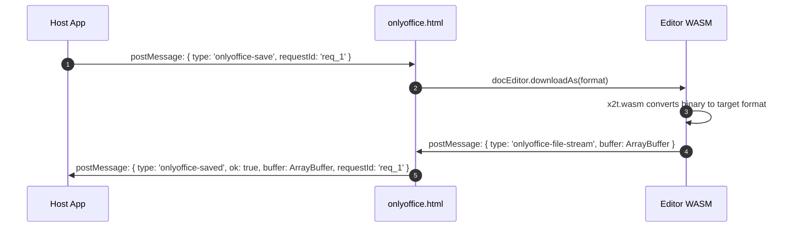

# File Stream Extraction Architecture

> A deep technical explanation of how **bedoffice** intercepts client-side document conversions in `x2t.wasm` and delivers raw binary byte streams (`ArrayBuffer`) directly to the host application without server callbacks.

---

## 1. The Core Architectural Challenge

In standard ONLYOFFICE Document Server architectures, saving relies on server-side webhooks:
- `editorConfig.callbackUrl`: The Document Server POSTs the saved file directly to your backend.
- `docEditor.downloadAs()` ➔ `onDownloadAs`: Returns a remote URL hosted on the Document Server.

### The Offline WASM Dilemma
In an offline, zero-backend WASM environment, neither of these mechanisms exists. By default, invoking `downloadAs()` executes the following call chain:

```
docEditor.downloadAs('docx')
  └─ baseEditorsApi.downloadAs()                 (offline.js rewrite)
       └─ _downloadAsFromLocal()
            └─ AscCommon.x2t.convertFromBin(...)  (WASM client-side conversion)
                 └─ result.binary                 ← The actual file bytes!
                      └─ AscCommon.x2t.downloadFile(binary, fileName)
                           └─ Creates <a download> ➔ triggers browser download popup
```

Without modification, the browser only triggers a native file download prompt. The host JavaScript application never receives the binary bytes and has no programmatic way to save the file to a custom backend or database.

---

## 2. The Solution: Hooking `x2t.downloadFile`

The raw file bytes are present in the first parameter (`data`) of `AscCommon.x2t.downloadFile(data, fileName)`.

### Step 1: Hooking the Binary Output
Inside `vendor/sdkjs/common/wasm/x2t/x2t_helper.js`, `X2TConverter.prototype.downloadFile` is intercepted:

```javascript
X2TConverter.prototype.downloadFile = function (data, fileName) {
    // 1. Extract raw ArrayBuffer from WASM memory
    try {
        var buffer;
        if (data instanceof ArrayBuffer) {
            buffer = data.slice(0);
        } else if (data && data.buffer instanceof ArrayBuffer) {
            buffer = data.buffer.slice(data.byteOffset || 0, (data.byteOffset || 0) + data.byteLength);
        } else if (data) {
            buffer = new Uint8Array(data).buffer;
        }

        if (buffer) {
            var ext = (String(fileName || '').split('.').pop() || '').toLowerCase();
            var payload = { 
                type: 'onlyoffice-file-stream', 
                fileName: fileName, 
                fileType: ext, 
                buffer: buffer 
            };
            
            // Dispatch postMessage to parent and top windows
            if (window.parent && window.parent !== window) window.parent.postMessage(payload, '*');
            if (window.top && window.top !== window) window.top.postMessage(payload, '*');
        }
    } catch (e) {}

    // 2. Check if the host requested stream-only mode
    var streamOnly = false;
    try {
        for (var w = window, depth = 0; w && depth < 6; depth++) {
            if (w.OO_FILE_STREAM_ONLY === true) { streamOnly = true; break; }
            if (w.parent === w) break;
            w = w.parent;
        }
    } catch (e) {}

    // 3. Suppress the browser's automatic file download prompt
    if (streamOnly) {
        return;
    }

    // Default fallback: Trigger native browser download
    originalDownload(data, fileName);
};
```

---

## 3. The `onlyoffice.html` Bridge Layer

`onlyoffice.html` acts as a mediator:
1. Sets `window.OO_FILE_STREAM_ONLY = true`.
2. Listens for `onlyoffice-file-stream` from the inner editor frame.
3. Forwards the `ArrayBuffer` to the top-level host application via `onlyoffice-saved` along with the matching `requestId`.



---

## 4. Consuming the Binary Stream in Host Applications

Host applications can convert the resulting `ArrayBuffer` directly into a `Blob`, upload it via `fetch` / `FormData`, or persist it in IndexedDB:

```javascript
window.addEventListener('message', async (event) => {
    const data = event.data;
    if (data && data.type === 'onlyoffice-saved' && data.ok) {
        // Convert ArrayBuffer into Blob
        const fileBlob = new Blob([data.buffer], { 
            type: 'application/vnd.openxmlformats-officedocument.wordprocessingml.document' 
        });

        // Example: Upload directly to backend API
        const formData = new FormData();
        formData.append('file', fileBlob, data.fileName || 'document.docx');
        
        await fetch('/api/documents/save', {
            method: 'POST',
            body: formData
        });
        
        console.log('Document successfully persisted to server!');
    }
});
```

---

## 5. Summary

By intercepting `x2t.downloadFile` at the WASM boundary, **bedoffice** turns ONLYOFFICE into a pure client-side document processing engine that can be plugged into any frontend architecture with zero backend constraints.
